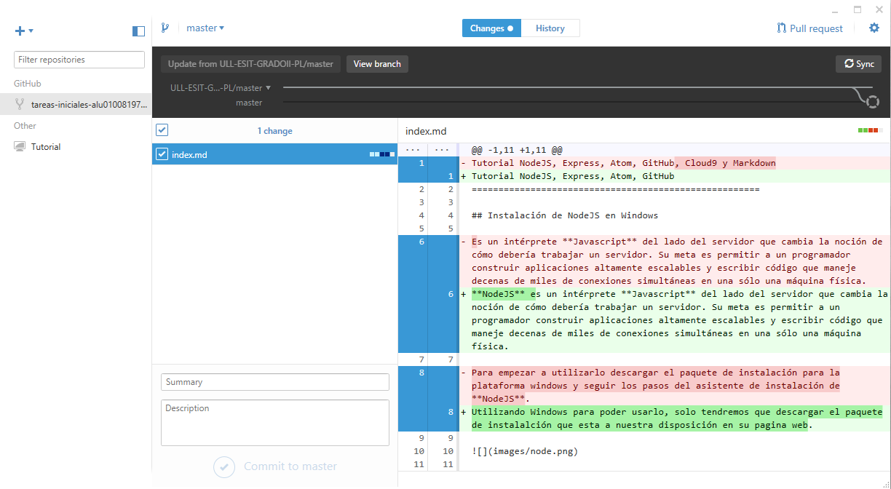

Tutorial NodeJS, Express, Atom, GitHub
======================================================

## Instalación de NodeJS en Windows

**NodeJS** es un intérprete **Javascript** del lado del servidor que cambia la noción de cómo debería trabajar un servidor. Su meta es permitir a un programador construir aplicaciones altamente escalables y escribir código que maneje decenas de miles de conexiones simultáneas en una sólo una máquina física.

Utilizando Windows para poder usarlo, solo tendremos que descargar el paquete de instalalción que esta a nuestra disposición en su pagina web.


Instalaremos tambien el framework **Express** con la consola de **NodeJS** y el siguiente comando:

**Comando**

> `npm install express --save`


## Instalación de Atom

Usaremos **Atom** como editor de texto para el desarrollo de nuestros proyectos, para ello descargamos el instalador en la página oficial de Atom, y a continuación ejecutaremos el asistente de instalación.


## Instalación de GitHub Desktop

GitHub es una plataforma para alojar proyectos utilizando el sistema de control de versiones **Git**. Para instalarlo accedemos a la página oficial de **GitHub** y descargamos el instalador que ejecutaremos posteriormente para iniciar el asistente de instalación.

Una vez instalado configuramos nuestra cuenta de **GitHub** en la aplicación para poder sincronizar nuestro repositorio tanto local como remoto, en caso de no tener cuenta crearemos una en la página de **GitHub** y ya podremos utilizar la aplicación.



## Markdown

Markdown es un lenguaje de marcado ligero, lo vamos a utilizar en el editor de texto Atom ya que incorpora por defecto este formato y podremos obtener un live preview mientras vamos desarrollando además de poder exportarlo a HTML sin la necesidad de usar un conversor adicional.

Sintaxis:


Encabezados
```
# Encabezado H1
## Encabezado H2
### Encabezado H3
```
Tipografía
```
**Negrita**
*Cursiva*
> Citas
Parrafo separar por lineas en blanco
`Codigo`
```
Recursos
```

* [Links](https://example.com)
```
Listas
```
1. Lista 1
2. Lista 2

* Lista 1
* Lista 2
```
